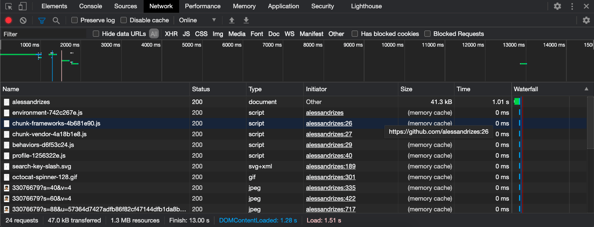

# Javascript IV

## Protocolo HTTP
- [Uma visão geral do HTTP](https://developer.mozilla.org/pt-BR/docs/Web/HTTP/Overview);

HTTP é um protocolo que faz a conexão entre um receptor, normalmente o navegador (_browser_) e um servidor. Ela é a base da transferência de dados na Web.

Quando um site é acessado, seu navegador envia uma solicitação (_request_) para o servidor onde ele está hospedado. Este, por sua vez, envia uma resposta (_response_) com o resultado dessa solicitação.


Por exemplo, ao chamar um script, uma folha de estilo ou uma imagem, é feita uma requisição para cada um desses recursos.



### Anatomia de uma Requisição HTTP


- Métodos HTTP, são verbos como GET, POST, PUT, DELETE. As requisições para pegar e mostrar dados normalmente são feitas através de GET. Os demais verbos podem ser usados para modificar dados do servidor ou banco de dados;
- Origem e porta da requisição e caminho do arquivo solicitado;
- Versão do protocolo HTTP;
- Cabeçalhos (_header_) com informações para os servidor;
- Corpo (_body_) que são necessários para algumas requisições POST.

### Anatomia de uma Resposta HTTP


- Versão do protocolo HTTP que o servidor segue;
- Código de status (veja referências abaixo);
- Cabeçalhos (_header_) com informações vindas do servidor;
- Corpo (_body_) com dados solicitados, se houver.

**Código de Status das Respostas**
- [HTTP Statuses](https://httpstatuses.com/)
- [HTTP Dogs](https://httpstatusdogs.com/)
- [HTTP Cats](https://http.cat/)

----------------

## API
- [Open APIs](https://github.com/public-apis/public-apis);
- [What is an API? [Vídeo em inglês]](https://www.youtube.com/watch?v=s7wmiS2mSXY);
- [O que significa API e como ela funciona](https://www.redhat.com/pt-br/topics/api/what-are-application-programming-interfaces)

API é a abreviação de _Application Programming Interface_, ou em português, Interface de Programação de Aplicativos. Trata-se de uma interface de comunicação e integração entre aplicações.

Por exemplo, para usar dados do Maps, o Google desenvolveu uma API para ser consumida entre desenvolvedoras.

Cada API possui uma documentação e modo de comunicação, quais informações (headers e body) enviar para a API para conseguir ter acesso a seus dados. Algumas delas permitem que seja feita alteração de dados e não somente consulta.

Alguns verbos(métodos), que são usados:

Método | O que faz        | Status de retorno |
-------|------------------|-------------------|
GET    | Traz informações | 200               |
POST   | Cria um novo item| 201               |
PUT    | Atualiza um item | 200               |
DELETE | Remove um item   | 200               |

- [O que é REST API](https://rockcontent.com/blog/rest-api/);
- [RESTful API (REST API) - inglês](https://searchapparchitecture.techtarget.com/definition/RESTful-API);

É possível também se deparar com a nomenclatura **REST API**. É uma abreviação para _Representational State Transfer_, ou em português, Transferência de Estado Representacional.

Trata-se de uma arquitetura em que uma API é construída, seguindo determinadas práticas, usando os verbos existentes do protocolo HTTP. É como se fosse um método BEM para APIs. É possível fazer um estilo CSS sem seguir o método, mas pode ser vire uma bagunça e não seja intuitivo. A arquitetura REST API faz com que o consumo das APIs sejam mais intutivos e organizados.


### Acessando dados de APIs
- [JSON Placeholder](https://jsonplaceholder.typicode.com/guide/);

Para acessar uma API, via de regra, basta acessarmos sua URL em um navegador. Ela nos retorna o dado designado a esse caminho, normalmente um JSON.

Acessando a partir do navegador, estamos fazendo uma requisição `GET`. Para fazer requisição com outros verbos (`POST`, por exemplo), temos que usar outras ferramentas. Veja a seção [requisições](#requisições).

----------------

## JSON
JSON é a abreviação de JavaScript Object Notation ou Notação de Objeto Javascript. É uma sintaxe para armazenar e tranferir dados. Trata-se de uma **string** que se parece bastante com um **objeto** Javascript.

```json
[
  {
    "nome": "Amanda",
    "idade": 21,
    "profissão": "desenvolvedora"
  },
  {
    "nome": "Joana",
    "idade": 12,
    "profissão": "professoa"
  }
]
```

Nota-se que as propriedades, no JSON, necessariamente tem que estar entre `""`.

### JSON.parse(data)
- [JSON.parse()](https://developer.mozilla.org/en-US/docs/Web/JavaScript/Reference/Global_Objects/JSON/parse);

O método `JSON.parse(data)` transforma a `data` string do JSON em um objeto Javascript para ser manipulado e o retorna.

```javascript
const parsedData = JSON.parse(data);
```

----------------

## Requisições

### Fetch

- [Fetch()](https://developer.mozilla.org/en-US/docs/Web/API/WindowOrWorkerGlobalScope/fetch);
Um método usado para iniciar requisições e para transferências de dados entre recursos web. O `fetch()` retorna uma `Promise`.
- [Promise](https://developer.mozilla.org/pt-BR/docs/Web/JavaScript/Reference/Global_Objects/Promise) é um objeto que representa o sucesso ou fracasso de uma operação assíncrona. Elas são bastante usadas dentro de outras estruturas apresentadas no ES6.

### Anatomia de fetch()

Para realizar uma requisição `GET`, sem informações adicionais:

```javascript
function getDados (url) {
    fetch(url)
        .then(response => response.json())
        .then(json => console.log(json))
        .catch(erro => console.log(erro));
}
getDados(url);
}
```

Opcionalmente, é possível adicionar [informações da requisição](#anatomia-de-uma-requisição-http), como segundo parâmetro, por meio de um objeto.

```javascript
fetch(url, {
    method: 'GET',
    headers: {
      'Content-Type': 'image/jpeg'
    },
    cache: 'default'
  })
  .then(response => response.json())
  .then(json => console.log(json))
  .catch(erro => console.log(erro));
}
```

### async e await

- [Expressão da função async](https://developer.mozilla.org/pt-BR/docs/Web/JavaScript/Reference/Operators/async_function);

A palavra-chave `async` é usada em declarações ou expressões de funções. Assim, elas se tornam funções assíncronas e permitem o uso do `await` dentro delas.

Elas normalmente são usadas em conjunto de funções assíncronas, como `Promise` (e, consequentemente, `fetch`), quando é necessário esperar a resolução desta para dar continudade às operações seguintes.

```javascript
async function getDados(url) {
    const response = await fetch(url);
    const json = await response.json();
    return json;
}
getDados(url)
      .then(res => console.log(res))
      .catch(err => console.error(err));
```

Exemplo de try...catch:
```javascript
async function getDados(url) {
    try {
        const response = await fetch(url);
        const json = await response.json();
        console.log(json);
    } catch (err) {
        console.error(err);
    }
}
getDados(url);
```

## XMLHttpRequest

- [XMLHttpRequest](https://developer.mozilla.org/en-US/docs/Web/API/XMLHttpRequest);

XMLHttpRequest (XHR) é um objeto que são usados para interagir com servidores. São usados para receber dados de uma URL sem ter que atualizar de novo a página - é criado uma requisição assíncrona.

Apesar de ter "XML" no seu nome, a requisição de `XMLHttpRequest` pode receber qualquer tipo de dado. 

### Anatomia de uma requisição XMLHttpRequest

- [Sobre os códigos readyState](https://developer.mozilla.org/pt-BR/docs/Web/API/XMLHttpRequest/readyState);

```javascript
// cria um novo construtor XMLHttpRequest
const request = new XMLHttpRequest();
const metodo = "GET";
const url = "https://exemplo.com";

// inicializa a requisição
request.open(metodo, url, true);

// adiciona um evento para ser ativado quando o readyState mudar
request.addEventListener("readystatechange", function () {
  // verifica se a conexão foi bem sucedida
  if (request.readyState == 4 && request.status == 200) {
    // atribui a uma nova variável o JSON já transformado em objeto Javascript (através do parse())
    const data = JSON.parse(request.response);
  }
})

// envia a requisição para o servidor
request.send();
```